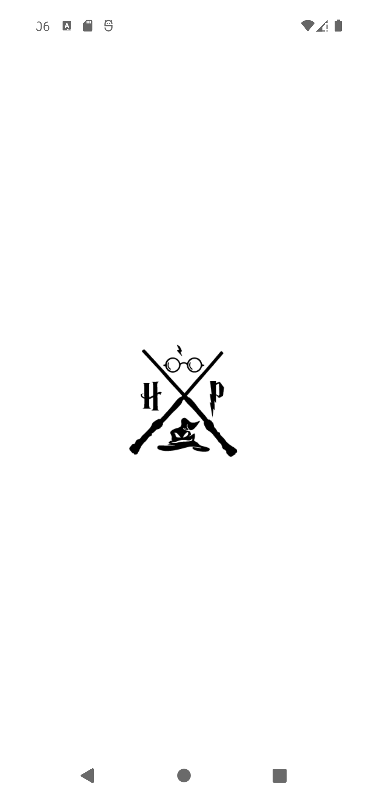
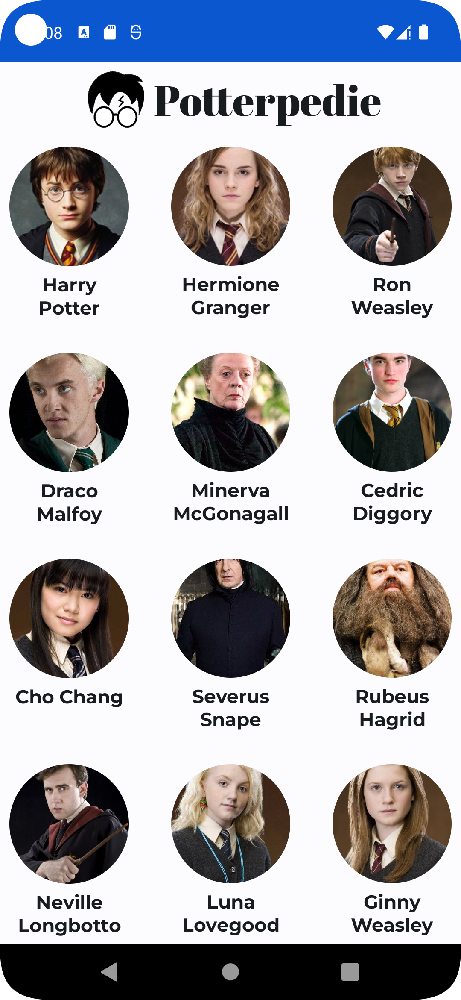
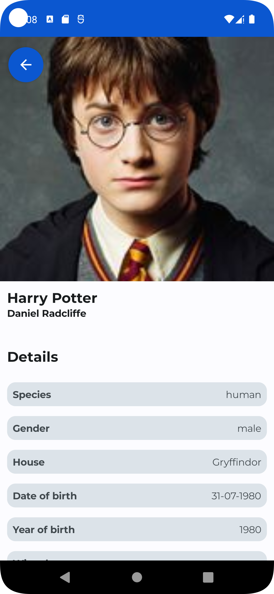
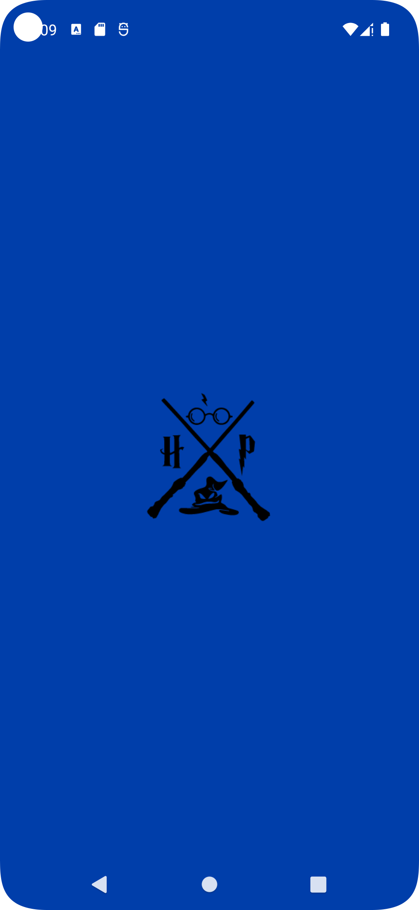
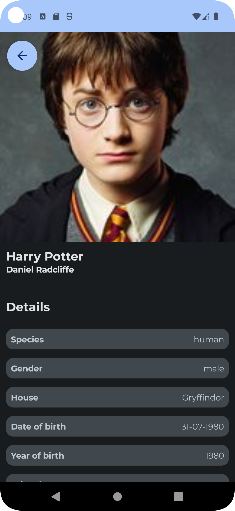

# Potterpedie

Basic example project consuming HP-API. App uses mvvm architecture design pattern.

## **Screenshots**

- #### Light Mode
&emsp;
&emsp;

- #### Dark Mode
&emsp;
&emsp;

## Tech Stack
- [Kotlin](https://kotlinlang.org/docs/reference/)

- [Retrofit](https://github.com/square/retrofit)
* [Dagger-Hilt](https://dagger.dev/hilt/)

* [Coroutines](https://developer.android.com/kotlin/coroutines)
* [Flow](https://developer.android.com/kotlin/flow)
* [Coil](https://coil-kt.github.io/coil/compose/)

* [Jetpack Components:](https://developer.android.com/topic/architecture?gclid=Cj0KCQjw8O-VBhCpARIsACMvVLOH1satX45o9f4PMQ4Sxr7bG9myl6-KZL9nYda8PJsHV7m2uJL8bzgaAmqiEALw_wcB&gclsrc=aw.ds)
  * [Jetpack Compose](https://developer.android.com/jetpack/compose?gclid=Cj0KCQjwhqaVBhCxARIsAHK1tiMMwHsxQ8Z25jyEdtLha9erq11wROoEfL6RqpGMprgbDTNuMO3_Ri8aAu5EEALw_wcB&gclsrc=aw.ds)
  * [View Model](https://developer.android.com/topic/libraries/architecture/viewmodel)
  * [Lifecycle]( https://developer.android.com/topic/libraries/architecture/lifecycle)
  * [Android KTX](https://developer.android.com/kotlin/ktx.html)
* [Mock web server](https://coil-kt.github.io/coil/compose/)

## Data Source
[HP-API](https://hp-api.onrender.com/).
